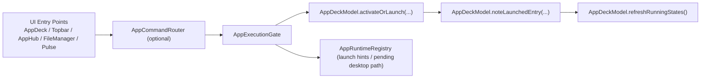

# Architecture Notes

## Execution flow (one gate)

All app launches should pass through `AppExecutionGate`:

1. UI entry point (AppDeck / Shell / AppHub / future FileManager / Terminal)
2. `AppCommandRouter` (optional action dispatch for external modules)
3. `AppExecutionGate` (`launchDesktopEntry(...)` / `launchEntryMap(...)`)
4. `AppDeckModel.activateOrLaunch(...)`
5. `AppDeckModel.noteLaunchedEntry(...)`
6. `AppDeckModel.refreshRunningStates()` reconciles pinned + transient entries

This avoids fragmented launch logic and keeps monitoring consistent.

Recommended API by source:
- AppDeck item: `AppExecutionGate.launchDesktopEntry(...)`
- AppHub / shortcut grid / file-manager style entries: `AppExecutionGate.launchEntryMap(entry, source)`
- Terminal-like command source: `AppExecutionGate.launchCommand(...)`

## Running app model

- Pinned entries come from `~/.AppDeck/*.desktop`.
- Runtime entries are transient and synthesized from:
  - observed windows/processes,
  - user launch hints (`AppRuntimeRegistry`),
  - pending desktop-path hints for startup lag.

## Shortcut model

- Source directory: `~/Desktop`.
- Supports shortcut types:
  - desktop file
  - file/folder
  - web URL
- Slot mapping persists in `~/Desktop/.desktop_shell_slot_map.json`.

## Preferences

`DesktopSettings` (settingsd SSOT) owns persisted runtime options
(motion, drag thresholds, autohide, verbose logging).

## Design constraints

- Keep shell interactions deterministic under polling lag.
- Prefer path-based identity for `.desktop` entries.
- Keep launch + monitoring idempotent so model rebuilds do not drop transient state.

## Portal

- Lihat `docs/PORTAL.md` untuk kontrak `org.slm.Desktop.Portal` (khususnya `OpenURI`), urutan prioritas policy scheme, dan konfigurasi runtime.
