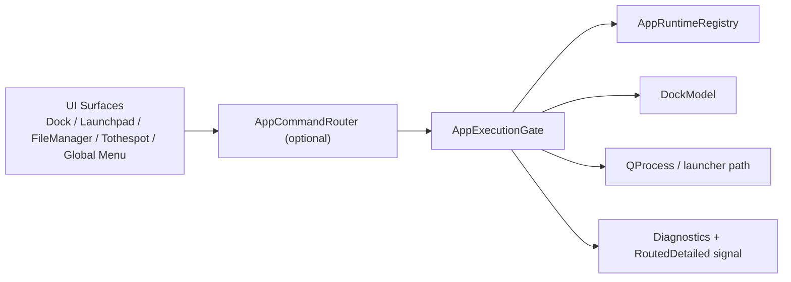
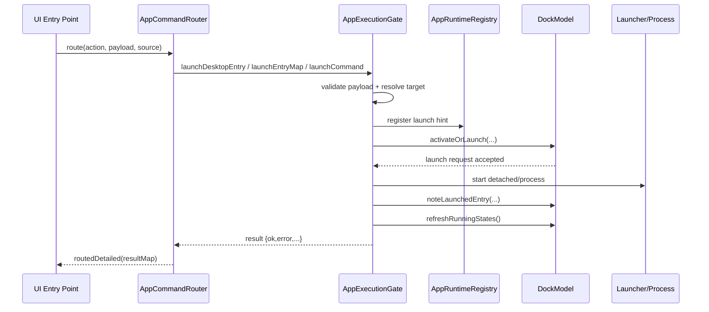

# AppExecutionGate Architecture

Dokumen ini merinci arsitektur jalur eksekusi aplikasi satu pintu (`AppExecutionGate`).

## Component Diagram

## Launch Sequence

## Design Rules

- Semua jalur launch baru wajib masuk ke `AppExecutionGate`.
- UI tidak boleh mengeksekusi proses aplikasi langsung.
- `AppCommandRouter` dipakai untuk normalisasi action lintas modul.
- Status runtime dan launch-hint wajib disinkronkan ke `DockModel` dan `AppRuntimeRegistry`.

