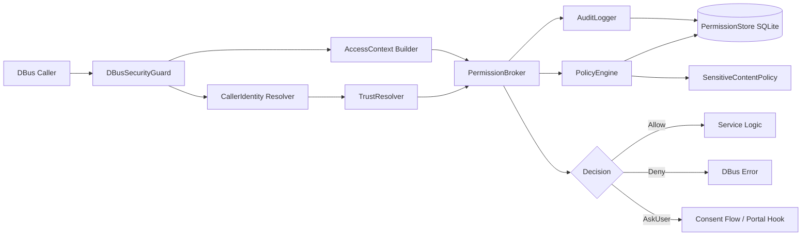

# SLM Permission Foundation (Qt6/Wayland/DBus)

Dokumen ini mendefinisikan pondasi permission/capability untuk SLM Desktop.
Fokus: backend enforcement, bukan popup UI.

## 1. Security Objectives

- Default deny untuk `ThirdPartyApplication`.
- Capability-based policy (bukan method-based hardcode per service).
- Keputusan terpusat di backend (`PolicyEngine`).
- UI/QML hanya presentasi consent, tidak menegakkan izin.
- Siap untuk portal mediation di fase berikutnya.

## 2. Trust Model

- `CoreDesktopComponent`
  - Shell, topbar, launcher, official filemanager/tothespot.
- `PrivilegedDesktopService`
  - daemon desktop internal (`desktopd`, `slm-fileopsd`, `slm-devicesd`, `slm-portald`).
- `ThirdPartyApplication`
  - app normal/sandbox/plugin eksternal.

## 3. Request Pipeline



## 4. Modules (Implemented)

Lokasi: `src/core/permissions/`

- `CallerIdentity.h/.cpp`
  - Resolve `busName`, `pid`, `uid`, executable path dari DBus message.
- `Capability.h/.cpp`
  - Enum capability + konversi string.
- `AccessContext.h/.cpp`
  - Context runtime akses (resource, gesture, sensitivity).
- `PolicyDecision.h/.cpp`
  - Decision object (`Allow`, `Deny`, `AskUser`, dll).
- `PermissionStore.h/.cpp`
  - SQLite schema + CRUD permission + app registry + audit log.
- `AuditLogger.h/.cpp`
  - Tulis event keputusan tanpa bocor isi sensitif.
- `TrustResolver.h/.cpp`
  - Klasifikasi trust level caller.
- `SensitiveContentPolicy.h/.cpp` (optional)
  - Block default untuk `Critical` pada non-core.
- `PolicyEngine.h/.cpp`
  - Rule evaluation sentral.
- `PermissionBroker.h/.cpp`
  - Entry request access; sinkronkan store + audit.
- `DBusSecurityGuard.h/.cpp`
  - Middleware DBus untuk mapping method→capability + check policy.

## 5. Core Data Structures

### CallerIdentity

- `busName`
- `appId`
- `desktopFileId`
- `executablePath`
- `pid`
- `uid`
- `sandboxed`
- `trustLevel`
- `isOfficialComponent`

### AccessContext

- `capability`
- `resourceType`
- `resourceId`
- `initiatedByUserGesture`
- `initiatedFromOfficialUI`
- `sensitivityLevel` (`Low|Medium|High|Critical`)
- `timestamp`
- `sessionOnly`

### PolicyDecision

- `type` (`Allow|Deny|AskUser|AllowOnce|AllowAlways|DenyAlways`)
- `capability`
- `reason`
- `persistentEligible`

## 6. SQLite Schema

```sql
CREATE TABLE permissions (
  id INTEGER PRIMARY KEY AUTOINCREMENT,
  app_id TEXT NOT NULL,
  capability TEXT NOT NULL,
  decision TEXT NOT NULL,
  scope TEXT NOT NULL,
  resource_type TEXT,
  resource_id TEXT,
  created_at INTEGER NOT NULL,
  updated_at INTEGER NOT NULL
);

CREATE UNIQUE INDEX idx_permissions_unique
ON permissions(app_id, capability, COALESCE(resource_type, ''), COALESCE(resource_id, ''));

CREATE TABLE app_registry (
  id INTEGER PRIMARY KEY AUTOINCREMENT,
  app_id TEXT NOT NULL UNIQUE,
  desktop_file_id TEXT,
  executable_path TEXT,
  trust_level TEXT NOT NULL,
  is_official INTEGER NOT NULL DEFAULT 0,
  updated_at INTEGER NOT NULL
);

CREATE TABLE audit_log (
  id INTEGER PRIMARY KEY AUTOINCREMENT,
  app_id TEXT NOT NULL,
  capability TEXT NOT NULL,
  decision TEXT NOT NULL,
  resource_type TEXT,
  timestamp INTEGER NOT NULL,
  reason TEXT
);
```

## 7. Capability Set (Initial)

- Clipboard:
  - `Clipboard.ReadCurrent`
  - `Clipboard.WriteCurrent`
  - `Clipboard.ReadHistoryPreview`
  - `Clipboard.ReadHistoryContent`
  - `Clipboard.DeleteHistory`
  - `Clipboard.PinItem`
  - `Clipboard.ClearHistory`
- Search:
  - `Search.QueryApps`
  - `Search.QueryFiles`
  - `Search.QueryClipboardPreview`
  - `Search.ResolveClipboardResult`
  - `Search.QueryContacts`
  - `Search.QueryEmailMetadata`
  - `Search.QueryEmailBody`
- Actions:
  - `Share.Invoke`
  - `OpenWith.Invoke`
  - `QuickAction.Invoke`
  - `FileAction.Invoke`
- Accounts:
  - `Accounts.ReadContacts`
  - `Accounts.ReadCalendar`
  - `Accounts.ReadMailMetadata`
  - `Accounts.ReadMailBody`
- Screen:
  - `Screenshot.CaptureScreen`
  - `Screenshot.CaptureWindow`
  - `Screencast.Start`
- Notifications:
  - `Notifications.Send`
  - `Notifications.ReadHistory`

## 8. Default Policy (Current Engine)

- `CoreDesktopComponent`
  - allow by default, namun capability yang ditandai `requiresUserGesture` => `AskUser` jika gesture tidak valid.
- `PrivilegedDesktopService`
  - allow scoped; contoh `Accounts.ReadMailBody` untuk non-official privileged => `AskUser`.
- `ThirdPartyApplication`
  - allow low-risk terbatas (`Clipboard.WriteCurrent`, `Search.QueryApps`, `Search.QueryFiles`, `Notifications.Send`),
  - `AskUser` untuk action/screenshot/share/accounts metadata,
  - deny default untuk high-risk dan semua yang tidak diizinkan eksplisit.

## 9. DBus Guard Integration Example

```cpp
// service constructor
m_guard.registerMethodCapability("org.slm.Clipboard1", "GetHistoryPreview",
                                 Capability::ClipboardReadHistoryPreview);
m_guard.registerMethodCapability("org.slm.Clipboard1", "GetHistoryContent",
                                 Capability::ClipboardReadHistoryContent);

// in DBus method handler
QVariantMap ctx{
    {"resourceType", "clipboard-history"},
    {"initiatedByUserGesture", false},
    {"initiatedFromOfficialUI", false},
    {"sensitivityLevel", "High"}
};
const PolicyDecision d = m_guard.checkMethod(message(),
                                             "org.slm.Clipboard1",
                                             "GetHistoryContent",
                                             ctx);
if (!d.isAllowed()) {
    sendDbusError("org.slm.PermissionDenied", d.reason);
    return;
}
// continue service logic...
```

## 10. Subsystem Mapping Example

### Clipboard Service
- Preview path => `Clipboard.ReadHistoryPreview`.
- Full content => `Clipboard.ReadHistoryContent` + user gesture gating.

### Global Search
- Query summary => `Search.Query*` capability.
- Resolve full content => `Search.ResolveClipboardResult` atau capability spesifik high sensitivity.

### Share Service
- `Share.Invoke` hanya via trusted flow / user gesture.

### FileAction / QuickAction
- Eksekusi action tetap dicek capability (`QuickAction.Invoke`, `FileAction.Invoke`).

### Accounts
- Metadata vs body dipisah capability (`...Metadata` vs `...Body`).

## 11. Portal-ready Path

`PermissionBroker` adalah boundary yang akan dipakai untuk transisi ke portal:

- Sekarang:
  - `PermissionBroker -> PolicyEngine`.
- Fase berikutnya:
  - `PermissionBroker -> PolicyEngine -> Consent mediator (portal-like)` untuk `AskUser`.
- Kontrak capability/context tetap stabil.

## 12. Security Notes

- Audit log tidak boleh menyimpan isi clipboard/email/body.
- `initiatedByUserGesture` dari caller untrusted harus dinormalisasi ke `false`.
- Trust resolution wajib backend-side (`DBusSecurityGuard`), bukan dari QML.

