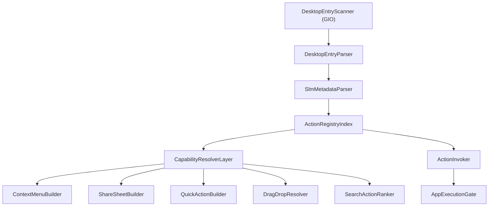

# SLM Desktop Action Framework - Modular Architecture

## Module Graph



```text
DesktopEntryScanner(GIO)
  -> DesktopEntryParser
      -> SlmMetadataParser
          -> ActionRegistryIndex
              -> CapabilityResolverLayer
                  -> builders:
                     - ContextMenuBuilder
                     - ShareSheetBuilder
                     - QuickActionBuilder
                     - DragDropResolver
                     - SearchActionRanker
              -> ActionInvoker(AppExecutionGate via ActionRegistry)
```

## Implemented Skeleton

- `src/core/actions/framework/slmdesktopentryscanner.*`
  - GIO-based scanner and monitor for `.desktop` roots.
- `src/core/actions/framework/slmdesktopentryparsermodule.*`
  - Parser module wrapper for desktop entries.
- `src/core/actions/framework/slmmetadataparser.*`
  - Converts parsed actions into typed metadata output + ACL AST map.
- `src/core/actions/framework/slmactionregistryindex.*`
  - In-memory indexes by `id/capability/mime/keyword`.
- `src/core/actions/framework/slmactioncachelayer.*`
  - Parsed-file freshness + condition AST cache.
- `src/core/actions/framework/slmcapabilityresolverlayer.*`
  - Capability resolver interface over registry.
- `src/core/actions/framework/slmcapabilitybuilders.*`
  - Context/Share/QuickAction/Search/DragDrop builders-resolvers.
- `src/core/actions/framework/slmactioninvoker.*`
  - Unified invocation entrypoint.
- `src/core/actions/framework/slmactionframework.*`
  - Orchestrator wiring scanner -> parser -> metadata -> index + resolver/invoker.

## Integration Notes

- Existing runtime remains stable: current DBus + UI still use `ActionRegistry`.
- New modules are compile-ready and can be migrated incrementally.
- OpenWith stays on the native FileManager pipeline (outside SLM capability framework).
- Next migration step:
  1. switch `SlmCapabilityService` to consume `SlmActionFramework`.
  2. expose registry-index-backed fast path for search/dragdrop.
