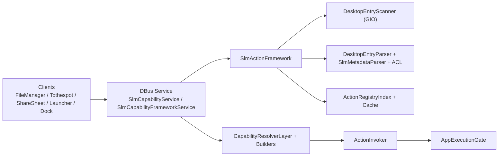
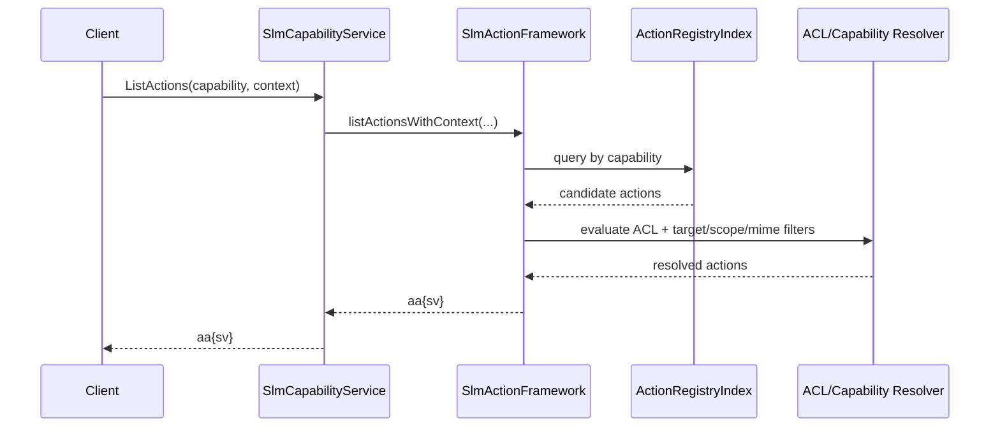
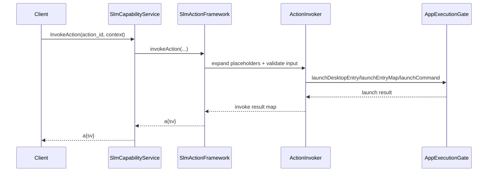

# SLM Capability Service Architecture

Dokumen ini menjelaskan jalur service untuk framework capability (`org.freedesktop.SLMCapabilities` dan facade internal terkait).

## Service Component Diagram

## Request Flow: `ListActions(capability, context)`

## Request Flow: `InvokeAction(action_id, context)`

## Contract Notes

- Registry shared untuk semua capability.
- ACL engine shared untuk semua capability.
- Resolver spesifik capability hanya memuat filtering/ranking behavior.
- Jalur eksekusi tetap satu pintu melalui `AppExecutionGate`.

