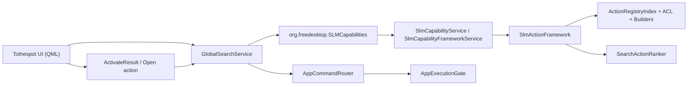
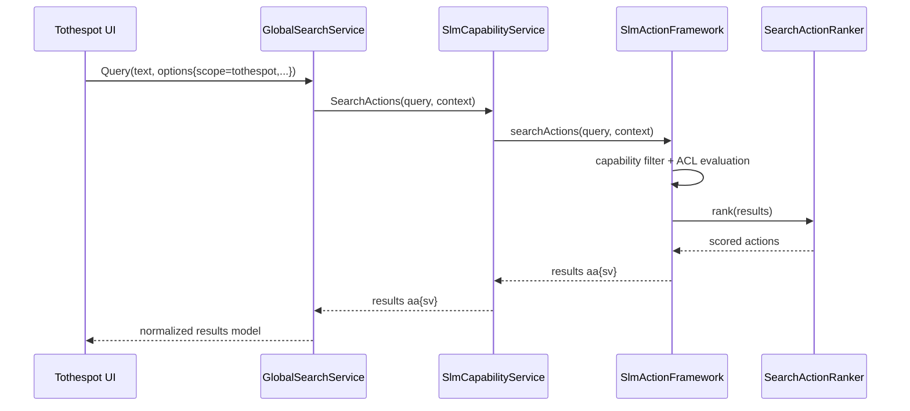
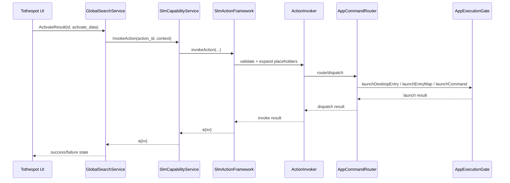

# Tothespot End-to-End Flow

Dokumen ini merinci jalur data Tothespot dari input query sampai action dijalankan.

## Component Diagram

## Query Sequence

## Activation Sequence

## Notes

- Scope canonical wajib `tothespot`.
- Hasil dari capability framework dapat digabung dengan provider lain (mis. recent files) di level `GlobalSearchService`.
- Eksekusi akhir tetap satu pintu melalui `AppExecutionGate`.

